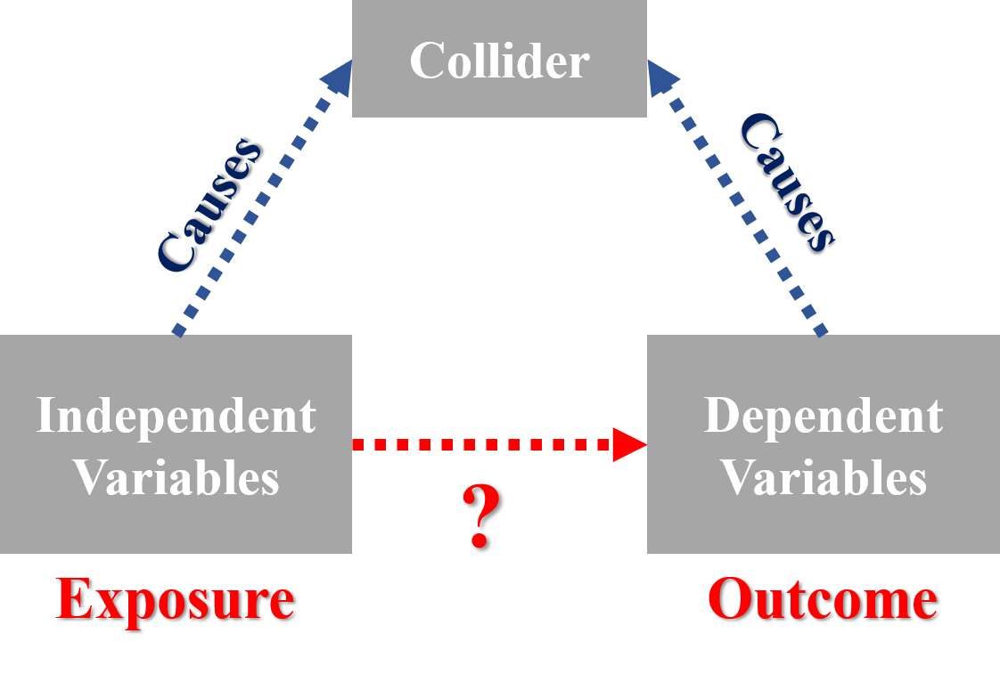

--- 
title: "Travel Demand Analysis Exercise"
author: "Chia Jung, Yeh///n National Yang Ming Chiao Tung University (NYCU), Taiwan"
date: "`r Sys.Date()`"
site: bookdown::bookdown_site
output:
  bookdown::html_document2: default
  bookdown::pdf_document2: default
documentclass: book
bibliography: [book.bib, packages.bib]
biblio-style: apalike
link-citations: yes
github-repo: ChiaJung-Yeh/Travel-Demand-Analysis
description: "Travel Demand Analysis Exercise"
---

```{r setup, include=FALSE}
knitr::opts_chunk$set(echo = TRUE)
library(dplyr)
library(data.table)
library(lubridate)
library(stringr)
library(ggplot2)
library(TWspdata)
library(httr)
library(texreg)
library(psych)
library(arm)
library(cowplot)
library(margins)
library(kableExtra)
library(stargazer)
library(ggrepel)
library(showtext)
library(knitr)
library(fontawesome)
library(DT)

windowsFonts(A=windowsFont("Times New Roman"))
windowsFonts(B=windowsFont("標楷體"))
```


# **Logistic & Poisson Regression**

:::problem
<font size="4">**`r fa(name="question-circle")`  PROBLEM**</font> 

1. Use simulation to demonstrate the following collider bias example (see the figure below).  
    + **Step 1:** Generate three random variables, X, Y, and Z, all following a binomial distribution. Among them, X and Y are independently generated while Z is generated depended on X and Y.  
    + **Step 2:** Run a logistic regression of Y on X (there should be no relationship).  
    + **Step 3:** Run a logistic regression of Y on X and Z (there should be some relationship).  
    *__Note:__ binomial distributions are a convenient choice; you can use other distributions if you like.*  

2. Based on the National Household Travel Survey data of Arizona State, answer the following questions.  
    + Use household vehicle ownership (HHVEHCNT) as the outcome variable. Run a single variable Poisson regression with either household size (HHSIZE), number of adults in the household (NUMADLT), or number of drivers in the household (DRVRCNT) as the predictor. Compare these three models, especially the estimated coefficients and model fit.  
    + Develop a logistic regression to predict “fully-equipped household” (You need to mutate a binary variable based on "vehown.fctr"). You need to incorporate at least one household variable, one built-environment variable, and on interaction term. Explain the estimation result.  
:::


## Collider Bias
Collider bias is used to describe the variable which is simultaneously influenced by the independent variable and the dependent variable in the model formulation. Though the causal variables influencing the collider are themselves not necessarily associated, that is, the dependent variable and the independent variable of the model have no casual effect, the spurious relationship is found under the intervention of collider variable. The casual graph of collider bias is shown in Figure \@ref(fig:casual-graph).   

```{r casual-graph, echo=F, eval=T, warning=F, out.width="40%", fig.align="center", message=F, fig.cap="Casual graph of collider bias"}

```

The simulation is conducted below to demonstrate the collider bias. Let the independent variable (X) and dependent variable (Y) be binomial random variable, and let the collider variable (Z) also be under binomial distribution, but associated with X and Y. Here we force the probability of binomial distribution to be the inverse logit of X plus Y. The code is shown below, note that the seed is set at 999, and the `glm()` function is used to develop logistic regression.The relationship of three variables are shown in Figure \@ref(fig:simulation-figure). We can find that the frequency of X and Y are approximately the same, while X and Z, Y and Z are apparently not independent. We then take Y as dependent variable, and construct two logistic regression models. For the first model, X is the only independent variable, while X and Z are both independent variable in the second model.  

```{r simulation, echo=T, eval=F, warning=F, message=F}
N=1000
set.seed(999)

# set the binomial random variable
X=rbinom(N, 1, 0.5)
Y=rbinom(N, 1, 0.5)
Z=rbinom(N, 1, invlogit(X+Y))

# logistic regression (Y~X)
glm(Y ~ X, family=binomial("logit"))

# logistic regression (Y~X+Z)
glm(Y ~ X+Z, family=binomial("logit"))
```

```{r simulation-figure, echo=F, eval=T, warning=F, message=F, fig.cap="Relationship between X, Y, and Z", out.width="100%", fig.align="center", fig.width=10}
N=1000
set.seed(999)
X=rbinom(N, 1, 0.5)
Y=rbinom(N, 1, 0.5)
Z=rbinom(N, 1, invlogit(X+Y))

p1=ggplot()+
  geom_bar(aes(x=X, y=Freq, fill=Y), data=data.frame(table(X, Y)), stat="identity")+
  scale_fill_brewer(palette="Set3")+
  ylab("Frequency")+
  ggtitle("Random X & Y")+
  theme_minimal()+
  theme(axis.title=element_text(family="A", size=15),
        axis.text=element_text(family="A", size=12),
        legend.title=element_text(family="A", size=15),
        legend.text=element_text(family="A", size=12),
        plot.title=element_text(family="A", size=18, face="bold", hjust=0.5))

p2=ggplot()+
  geom_bar(aes(x=X, y=Freq, fill=Z), data=data.frame(table(X, Z)), stat="identity")+
  scale_fill_brewer(palette="Set3")+
  ylab("Frequency")+ 
  ggtitle("X & Z")+
  theme_minimal()+
  theme(axis.title=element_text(family="A", size=15),
        axis.text=element_text(family="A", size=12),
        legend.title=element_text(family="A", size=15),
        legend.text=element_text(family="A", size=12),
        plot.title=element_text(family="A", size=18, face="bold", hjust=0.5))

p3=ggplot()+
  geom_bar(aes(x=Y, y=Freq, fill=Z), data=data.frame(table(Y, Z)), stat="identity")+
  scale_fill_brewer(palette="Set3")+
  ylab("Frequency")+ 
  ggtitle("Y & Z")+
  theme_minimal()+
  theme(axis.title=element_text(family="A", size=15),
        axis.text=element_text(family="A", size=12),
        legend.title=element_text(family="A", size=15),
        legend.text=element_text(family="A", size=12),
        plot.title=element_text(family="A", size=18, face="bold", hjust=0.5))

plot_grid(p1, p2, p3, ncol=3)
```

The result of logistic regression is shown in Table \@ref(tab:simulation-exe). We can find that X and Y has no significant relationship in *__Original Model__*. It is reasonable, since both X and Y are both random variable, they have no association. But interestingly, X and Y has a significant relationship in *__Collider Bias Model__*, it is because variable Z is included in the model, and cause a spurious relationship. The phenomenon illustrated by this simulation is called "Collider Bias". It suggests that collider variable should be removed to avoid the fallacy.  

```{r simulation-exe, echo=F, eval=T, warning=F, message=F, results="asis"}
glm1=glm(Y ~ X, family=binomial("logit"))
glm2=glm(Y ~ X+Z, family=binomial("logit"))

htmlreg(list(glm1, glm2), digits=3, caption="(#tab:simulation-exe)Collider Bias Model Result", caption.above=T, custom.model.names=c("Original Model", "Collider Bias Model"))
```

Take practical transport issue for instance. If we want to measure the effect of the private vehicles restriction on the modal share of public transport, the independent variable would be "private vehicles restriction",  while the dependent variable would be "modal share of public transport" in the model. Here, we add an independent variable reflecting the "air pollution", it might cause the model to be biased since the two variables are much correlated to "air pollution". Hence, in this model, "air pollution" can be termed as collider variable, and it is better to remove the collider one. 


## Poisson regression
Based on the National Household Travel Survey data of Arizona State, take household vehicle ownership variable as the outcome variable, and let the household size, number of adults, number of drivers be the independent variable respectively. The import code and raw data is shown below.  

```{r logit-import-show, eval=F, echo=T, message=FALSE, warning=TRUE, results="asis"}
# import data
dat_AZ=read.csv("./data/02-Exercise_2/dat_AZ.csv")

# take a glance at the data
dplyr::select(dat_AZ, HOUSEID, HHVEHCNT, HHSIZE, NUMADLT, DRVRCNT)
```

```{r logit-import, eval=T, echo=F, message=FALSE, warning=TRUE, results="asis"}
dat_AZ=read.csv("./data/02-Exercise_2/dat_AZ.csv")
dat_AZ_temp=dplyr::select(dat_AZ, HOUSEID, HHVEHCNT, HHSIZE, NUMADLT, DRVRCNT)
datatable(dat_AZ_temp, options=list(pageLength=6, scrollX=T))%>%
  formatStyle(columns=c(1:ncol(dat_AZ_temp)), fontSize='80%')
```

The code is shown below, and the model results are shown in Table \@ref(tab:Poisson-example). 

```{r Poisson-example-show, echo=T, eval=F, warning=F, message=F}
glm1=glm(HHVEHCNT ~ HHSIZE, family="poisson", data=dat_AZ)
glm2=glm(HHVEHCNT ~ NUMADLT, family="poisson", data=dat_AZ)
glm3=glm(HHVEHCNT ~ DRVRCNT, family="poisson", data=dat_AZ)
```

```{r Poisson-example, echo=F, eval=T, warning=F, message=F, results="asis"}
glm1=glm(HHVEHCNT ~ HHSIZE, family="poisson", data=dat_AZ)
glm2=glm(HHVEHCNT ~ NUMADLT, family="poisson", data=dat_AZ)
glm3=glm(HHVEHCNT ~ DRVRCNT, family="poisson", data=dat_AZ)
htmlreg(list(glm1, glm2, glm3), digits=3, caption="(#tab:Poisson-example)Poisson regression on HHVEHCNT", caption.above=T, custom.model.names=c("Model 1", "Model 2", "Model 3"))
```

The coefficient of HHSIZE in Model 1 is the expected difference in household vehicles (on the logarithmic scale) for each additional household members. Thus, the expected multiplicative increase is $e^{0.138}=1.148$, namely, a 14.8% positive difference in the household vehicles per household member. Similarly, in Model 2, if the number of adults increases by one, the number of household vehicles is expected to increase $e^{0.322}-1=38.0\%$. Last, in Model 3, if the number of drivers increases by one, the number of household vehicles would increase $e^{0.389}-1=47.6\%$.  

As for the model fit of each three models, we can find that the log likelihood is the largest in Model 3, representing that Model 3 offers a better fit to the data compared to others. Note that the log likelihood value of null model which only contains the constant term is -5095.911 ($LL(0)$), while the log likelihood is -3647.652 ($LL(\beta)$) for Model 3. It implies that the model indeed improves a lot compared to the null model. A formal method to examine the model is to conduct the likelihood ratio test. The Chi-square of the two model is 2896.5 (p-value is very close to 0), and hence, we can say that Model 3 is better than the null model, and best fit among the three. In addition, AIC and deviance also provide the model fit information, the lower the better. The prediction curve and the real data is shown in Figure \@ref(fig:pred-poisson).  

```{r pred-poisson, echo=F, eval=T, warning=F, message=F, fig.cap="Model fit visualization", out.width="100%", fig.align="center", fig.width=10}
pred=cplot(glm1, draw=F)
p1=ggplot()+
  geom_line(data=pred, aes(x=xvals, y=yvals))+
  geom_line(data=pred, aes(x=xvals, y=upper), linetype="dashed")+
  geom_line(data=pred, aes(x=xvals, y=lower), linetype="dashed")+
  xlab("HHSIZE") + ylab("HHVEHCNT")+
  geom_point(data=dat_AZ, aes(x=HHSIZE, HHVEHCNT))+
  ggtitle("Model 1")+
  theme_minimal()+
  theme(axis.title=element_text(family="A", size=15),
        axis.text=element_text(family="A", size=12),
        legend.title=element_text(family="A", size=15),
        legend.text=element_text(family="A", size=12),
        plot.title=element_text(family="A", size=18, face="bold", hjust=0.5))
pred=cplot(glm2, draw=F)
p2=ggplot()+
  geom_line(data=pred, aes(x=xvals, y=yvals))+
  geom_line(data=pred, aes(x=xvals, y=upper), linetype="dashed")+
  geom_line(data=pred, aes(x=xvals, y=lower), linetype="dashed")+
  xlab("NUMADLT") + ylab("HHVEHCNT")+
  geom_point(data=dat_AZ, aes(x=NUMADLT, HHVEHCNT))+
  ggtitle("Model 2")+
  theme_minimal()+
  theme(axis.title=element_text(family="A", size=15),
        axis.text=element_text(family="A", size=12),
        legend.title=element_text(family="A", size=15),
        legend.text=element_text(family="A", size=12),
        plot.title=element_text(family="A", size=18, face="bold", hjust=0.5))
pred=cplot(glm3, draw=F)
p3=ggplot()+
  geom_line(data=pred, aes(x=xvals, y=yvals))+
  geom_line(data=pred, aes(x=xvals, y=upper), linetype="dashed")+
  geom_line(data=pred, aes(x=xvals, y=lower), linetype="dashed")+
  xlab("DRVRCNT") + ylab("HHVEHCNT")+
  geom_point(data=dat_AZ, aes(x=DRVRCNT, HHVEHCNT))+
  ggtitle("Model 3")+
  theme_minimal()+
  theme(axis.title=element_text(family="A", size=15),
        axis.text=element_text(family="A", size=12),
        legend.title=element_text(family="A", size=15),
        legend.text=element_text(family="A", size=12),
        plot.title=element_text(family="A", size=18, face="bold", hjust=0.5))

plot_grid(p1, p2, p3, ncol=3)
```

Using number of drivers as the dependent variable is the best one to predict the household vehicle ownership. It is because that number of drivers is more correlated to the outcome variable (vehicle ownership), they are the most potential users of the vehicle, and probably own a car. As for the number of adults, not all the adults have driver license, and hence not much correlated to vehicle ownership relative to number of drivers. Last, household size also has a significant impact on the vehicle ownership though, it has the lowest effect. A possible reason is that household may consist of kids, who are absolutely prohibited to have a driver license, and thus have no vehicle usually. In conclusion, number of drivers can explain the most variance to predict the household vehicle ownership, for it is highly associated with vehicle ownership.  


## Logistic regression
To predict "fully-equipped household" by developing the logistic regression, we mutate a binary variable based on "vehown.fctr" in the data. The code is shown below.  

```{r mutate-show, echo=T, eval=F, warning=T, message=F, results="asis"}
dat_AZ=mutate(dat_AZ, FullyEquip=ifelse(vehown.fctr=="fully-equipped", 1, 0))
```

Before formulating the model, it is vital to clearly understand the definition of "fully-equipped household". The term means whether there are at least 1 car per driver in the household, and it is calculated by HHVEHCNT and DRVRCNT ($HHVEHCNT/DRVRCNT$). With this background knowledge, it is suggested not add two variables simultaneously in the model, or it might make the logistic regression nonidentified. Let us first show the model by considering both two variables, illustrated in Table \@ref(tab:logit-wrong).  

```{r logit-wrong-show, echo=T, eval=F, warning=T, message=F, results="asis"}
glm(FullyEquip ~ HHVEHCNT+DRVRCNT, family=binomial("logit"), data=dat_AZ)
```

```{r logit-wrong, echo=F, eval=T, warning=T, message=F, results="asis"}
dat_AZ=mutate(dat_AZ, FullyEquip=ifelse(vehown.fctr=="fully-equipped", 1, 0))
logit1=glm(FullyEquip ~ HHVEHCNT+DRVRCNT, family=binomial("logit"), data=dat_AZ)
htmlreg(list(logit1), digits=3, caption="(#tab:logit-wrong)Nonidentified logistic regression model result", caption.above=T)
```

In the model result, we can first find the "Warning", which shows that "algorithm did not converge", also the standard error of each variables and constant are abnormally high. This problem will occur if any linear combination of predicton is perfectly aligned with the data, with $y=1$ if and only if this linear combination of predictors exceeds some threshold. In this case $HHVEHCNT/DRVRCNT$ exactly determines the threshold of "fully-equipped household", if the value is not less than one, it is classified as "fully-equipped household", while not if the value is less than 1. And thus, placing two key factors in the model would directly decide whether fully-equipped or not. The two factors are not allowed to put in a same logistic regression model.  

Now, take one household variable (standardization of household size), one built-environment variable (whether household live in urban or not), and the interaction term (HHSIZE:urban) to develop a new logistic regression. Note that the correlation of HHSIZE and urban is close to 0, indicating that the variable is reasonable to place in the same model. The model result is shown in Table \@ref(tab:logit-new).  

```{r logit-new, echo=F, eval=T, warning=F, message=F, results="asis"}
logit2=glm(FullyEquip ~ c.hhsize+factor(urban)+factor(urban):c.hhsize, family=binomial("logit"), data=dat_AZ)

htmlreg(list(logit2), digits=3, caption="(#tab:logit-new)FullyEquip logistic regression model result", caption.above=T)
```

In Table \@ref(tab:logit-new), we can find that the coefficient of standardization of household size (c.hhsize) is -0.257, meaning that add one standard deviation of household size would drop $e^{-0.257}=0.77$ times of odds of fully-equipped. If the household lives in urban area, the odds of fully-equipped would decrease $e^{−0.159}=0.85$ times. Though this variable is not significant, the sign is expected. Since people would tend to have no car in the urban area, and use public transport instead (this is true for most of Asian cities, but I have no idea whether it is also true in Arizona), the negative sign proves that the household has a lower odds to be fully-equipped compared to the non-urban area. According to Chapter 4.5 in  *Data Analysis Using Regression and Multilevel/Hierarchical Models*, Gelman list the general principles of building regression models, and he suggests that if a predictor is not statistically significant and has the expected sign, it is generally fine to keep it in. Thus, retain the urban variable in the model might be reasonable. Also, the interaction variable in the model, we can find that the sign is also negative, which shows that if the household size is fixed, household living in urban would have a more negative effect on the odds of fully-equipped. Again, this inference might be weak, due to the coefficient of interaction term is also insignificant.  

